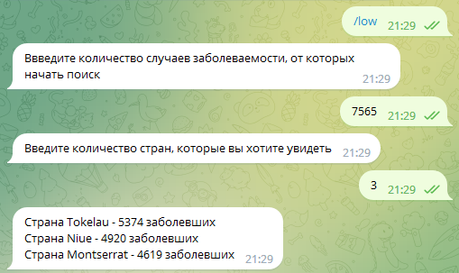
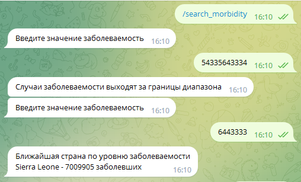

# Телеграмм бот для просмотра заболеваемости Covid-19 по разным странам мира
## В базе данных данного бота находится 218 стран всего мира со статистикой 
## Что вам нужно сделать, что бы обратиться к нему?
### Немного больше чем ничего:
- Установить себе приложение Telegram и иметь там свой аккаунт
- Перейти по этой ссылке ---> https://t.me/Foot_B_bot
- Нажать кнопку start
- Дождаться приветствия
## Что он умеет?
### У данного бота есть 7 методов работы:
- low - вывод стран с наименьшим показателем случаев заболевания в порядке убывания (пользователь вводит значение и количество стран (макс 50))
- high - вывод стран с наибольшим показателем случаев заболевания в порядке возрастания (пользователь вводит значение и количество стран (макс 50))
- customs - вывод стран с диапазоном заданных значений случаев заболевания (пользователь вводит 2 границы значений и количество стран (макс 50))
- history - история запросов (последние 10 запросов)
- search_countries - поиск стран из введенного пользователем текста (на англ. языке)
- search_morbidity - поиск страны по введенному параметру заболеваемость (или ближайшую к параметру)
- также бота можно поприветствовать с помощью сообщения 'Привет' или 'helo-world'
### Немного особенностей при работе с ним:
- help - помощь в навигации по телеграм боту
- при вводе некорректных данных вы увидите соответсвующее сообщение
### Примеры работы с ботом:
- Корректные параметры:
- 
- Некорректные параметры
- 

<h1>Использованные библиотеки:</h1>
<ul>
    <li>peewee ORM</li>
    <li>telebot</li>
    <li>request с запросом к API</li>
    <li>Линтер flake8</li>
</ul>
